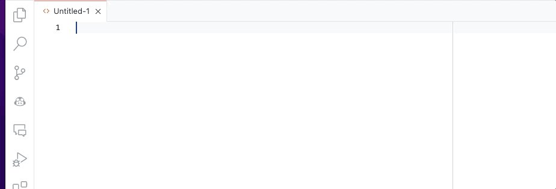

# DSFR Snippets

Extension VSCode pour intégrer des composants et icones DSFR dans votre HTML.
Uniquement les composants courant (bouton, badges, etc...)

Les options des composants sont visibles en commentaires lors de
l'insertion.

Site du design système : https://www.systeme-de-design.gouv.fr/

## Features

- Snippets HTML des composants DSFR.
- Icones DSFR.

## Problèmes connus

Tous les composants ne sont pas encore intégrés. N'hésitez pas à contribuer 🙏.

## Release Notes

### 1.3.0

- Add icon snippets.

### 1.2.0

Add some components.

- Champ de saisie - Input
- Lien - Link
- Ajout de fichier - Upload

### 1.1.0

Add some components.

- Bandeau d'information importante - Notice
- Badge - Badge

### 1.0.0

Initial release of DSFR snippets.

- Accordéon - Accordion
- Bouton - Button
- Alerte - Alert
